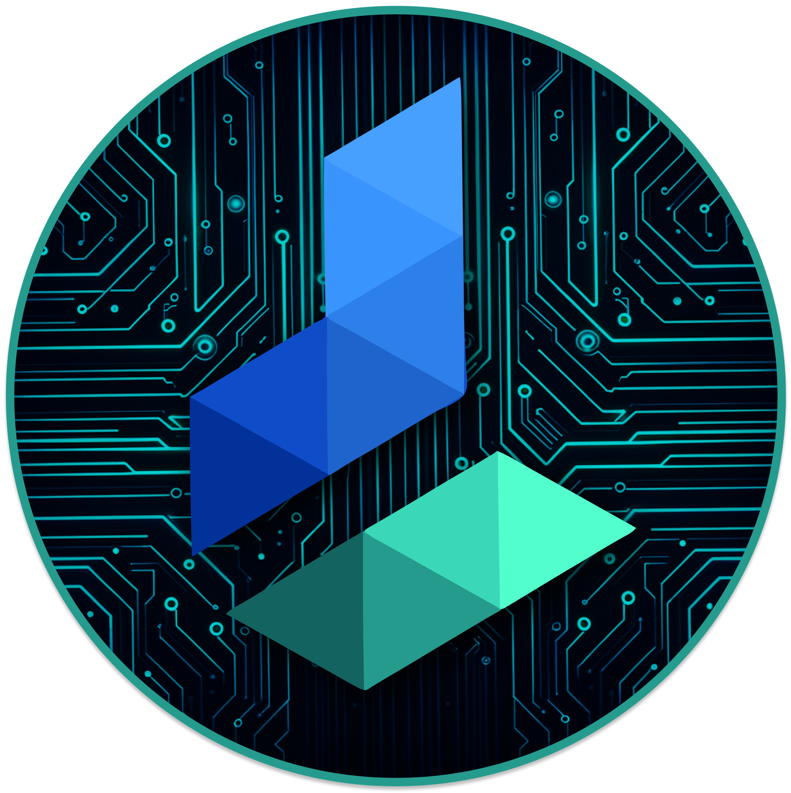

  

# Overview

This is a mono-repo for almost all of the Differential codebase. It contains the following repositories:

- [Control Plance](./control-plane/) The control plane is the central command & control for a differential cluster. This is fully open source and can be run on your own infrastructure without using the cloud offering.
- [Typescript SDK](./ts-core/) The Typescript SDK is the main way to interact with Differential. It is used to define services, call services, and run services.
- [Docs](./docs/) The docs are the main source of information for Differential. They are hosted at [docs.differential.dev](https://docs.differential.dev).

# What's Differential?

Differential helps you connect your services together 10x faster with delightful DX!

Differential is tailored for projects wanting to transition to a service-oriented model. It provides a straightforward path for breaking down complex codebases into manageable, independently scalable services. The platform focuses on reducing the overhead typically associated with service-oriented architecture with giving you the tools to keep your code co-located, but deployed as independent services.

This balance of simplicity and functionality makes Differential a practical choice for developers aiming to optimize their architecture without sacrificing development speed.

# Features

## Type Safety with Automated Service Contracts

- **Automated Contracts**: Generates service contracts automatically without a compile step, ensuring type safety across different services.

- **TypeScript Integration**: Leverages the lanuguage capabilities (Typescript SDK out now) to prevent runtime type errors and ensure reliable inter-service communication.

## Streamlined Development Process

- **No Additional Compile Steps**: Integrates seamlessly into your development workflow without the need for extra compile steps or external service definitions.

- **Rapid Iteration**: Mimics the simplicity of a single codebase, allowing for faster iterations and development cycles.

## Runtime Management and Flexibility

- **Independent Service Entrypoints**: Offers distinct entrypoints for each service at runtime, enabling them to be managed and scaled separately.

- **Scalability**: Ideal for applications requiring scalability, where services need to be independently deployable and manageable.

## Simplified Communication Layer

- **Fast Service Bus**: Under the hood, a fast service bus handles all inter-service communications.

- **Abstraction**: Developers can focus on writing application logic, as the communication layer is abstracted away.