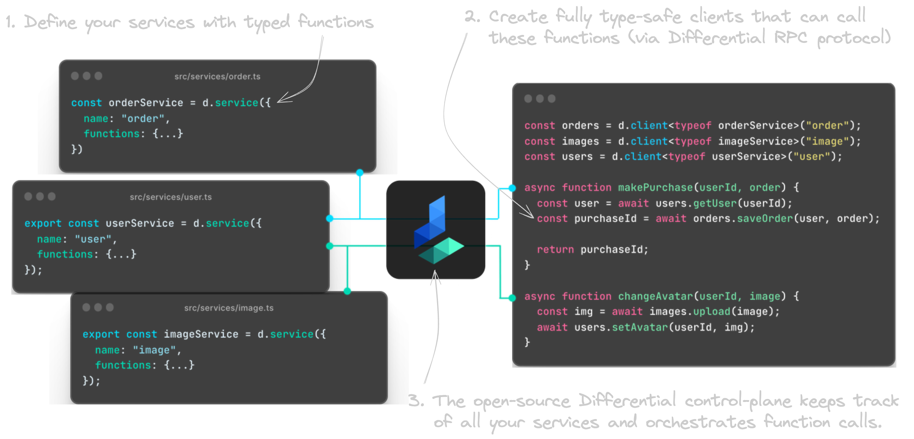
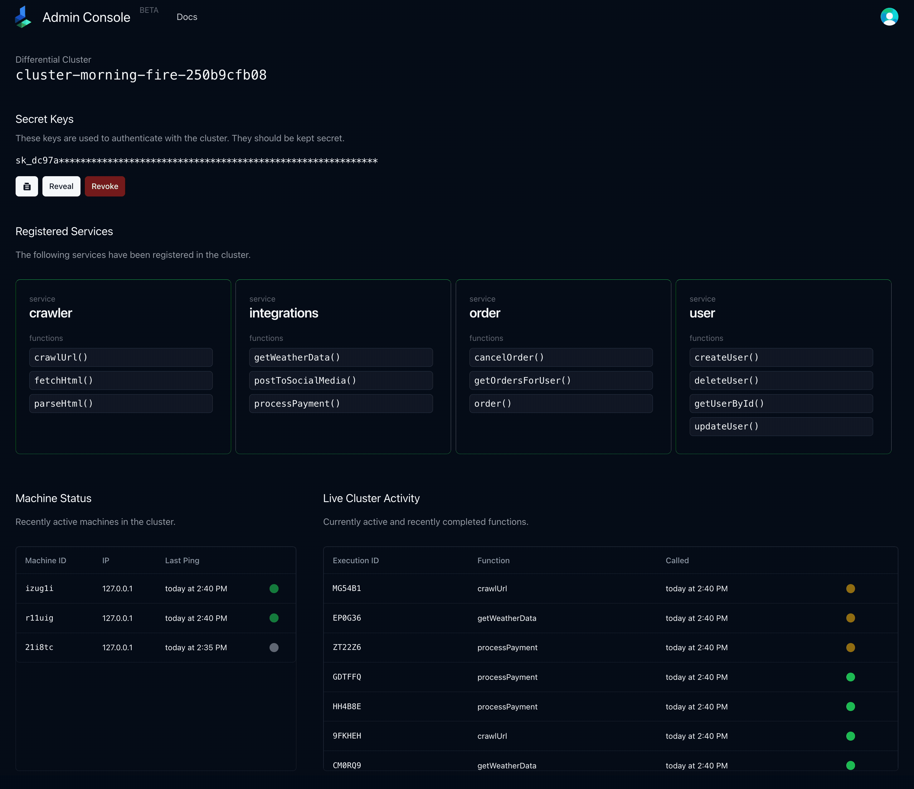
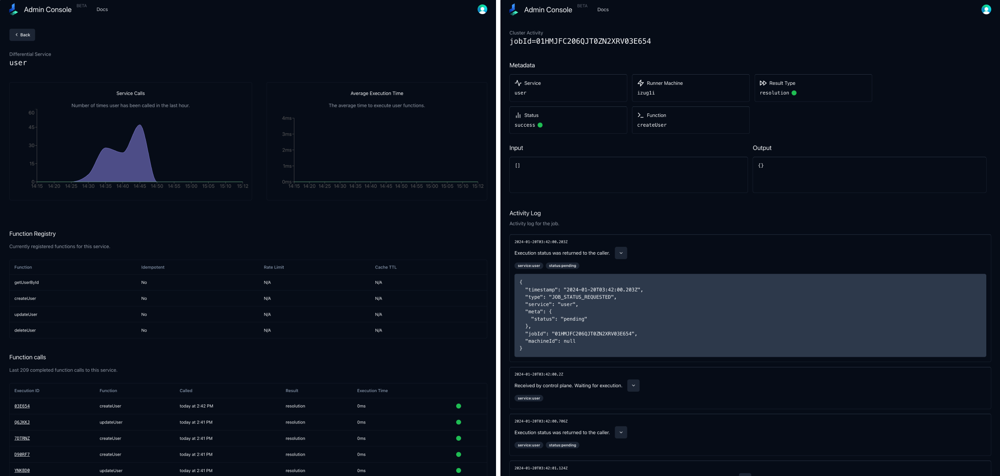

  

    

# Differential

Differential allows you to break up your monolithic Typescript service into highly malleable and composable services, without the boilerplate.

## The Problem

You have a well-architected monolith. You've determined that it's time to break it up into 2 or more services. But the overhead of going for a service-oriented/microservices architecture is traditionally very high. You have to:

1. Figure out which functionality to break out into a service
2. Split up the code
3. Decide on a service communication protocol (HTTP, gRPC, tRPC, etc)
4. Copy paste boilerplate code for each service and/or write libraries to abstract away the boilerplate
5. Set up obervability / health checks / etc for each service
6. Write/move the business logic for each service
7. Write the service interfaces for each service (e.g. protobufs, OpenAPI, ts-rest/zod)
8. Document the interplay of services for other developers

This is a lot of work, and it's not even the fun part of building a product. If business requirements change and you need to change the boundaries of your services, you have to do it all over again.

### This leads many engineering teams to:

1. Delay breaking up their monoliths when it would be beneficial to do so, or...
2. Break it up early and suffer the consequences of a poorly architected services architecture.

## The Solution

Differential is an **application code aware service mesh, and a distributed orchestrator**. It is designed to:

1. Make it easy to break up your monolith into services
2. Make it easy to change the boundaries of your services as your business requirements change
3. Make it easy to hit "Abort" and go back to a monolith if you need to

| Problem                                                                                               | Solution                                                                                                                                                                       |
| ----------------------------------------------------------------------------------------------------- | ------------------------------------------------------------------------------------------------------------------------------------------------------------------------------ |
| Figure out which functionality to break out into a service.                                           | 👍 This is the highest-value problem worth solving. Differential helps you focus on this problem.                                                                              |
| Split up the codebase                                                                                 | ✅ With Differential, you don't have to split up your codebase.                                                                                                                |
| Decide on a service communication protocol (HTTP, gRPC, tRPC, etc.).                                  | ✅ Differential abstracts this away from you, unless you want to look under the hood. It uses HTTP.                                                                            |
| Copy/Paste boilerplate code for each service and/or write libraries to abstract away the boilerplate. | ✅ Differential provides you with the tools to keep your code co-located, but deployable as independent services at runtime.                                                   |
| Set up observability / health checks / monitoring for each service.                                   | ✅ Differential comes with a dev console which gives you full observability down to the function level. You can see errors, detailed logs and execution times with zero-setup. |
| Write/move business logic for each service.                                                           | ✅ Differential services are simply javascript objects that define which functions (a.k.a business logic) belong to which service.                                             |
| Write the service interfaces for each service (e.g. protobufs, OpenAPI, ts-rest/zod).                 | ✅ Differential infers your service interface from your function types. Your services become end-to-end typesafe. There's no need for another interchange format.              |
| Document the interplay of services for other developers.                                              | ✅ Differential's dev console gives you a full view of your service registry, which functions are registered, and the live status for each.                                    |

# Documentation

All documentation is hosted at [docs.differential.dev](https://docs.differential.dev). Here are some quick links to get you started:

- [Quick Start](https://docs.differential.dev/getting-started/quick-start/)
- [Thinking in Differential](https://docs.differential.dev/getting-started/thinking/)
- [How it works under the hood](https://docs.differential.dev/advanced/architecture/)
- [Self-hosting](https://docs.differential.dev/advanced/self-hosting/)

# Features

- [x] [Open-Source Control Plane and Function Orchestration](https://github.com/differentialhq/differential/tree/main/control-plane)
- [x] [Stable Typescript SDK](https://docs.differential.dev/getting-started/quick-start/)
- [x] [Differential Cloud Beta](https://forms.fillout.com/t/9M1VhL8Wxyus)
- [x] [End-to-end Encryption](https://docs.differential.dev/advanced/advanced-usage/#end-to-end-encryption)
- [x] [Run functions idempotently](https://docs.differential.dev/advanced/advanced-usage/#idempotency)
- [x] [Observability and tracing at the function level](https://forms.fillout.com/t/9M1VhL8Wxyus)
- [x] [Service registry](https://forms.fillout.com/t/9M1VhL8Wxyus)
- [x] [Cache function results globally](https://docs.differential.dev/advanced/advanced-usage/#global-cache)
- [x] [Self-hosting on your own infrastructure](https://docs.differential.dev/advanced/self-hosting/)
- [ ] Per-function rate limiting
- [ ] One-line deployment to AWS Lambda
- [ ] AI-generated developer documentation
- [ ] Generate integration tests from telemetry data
- [ ] Managed API gateways for external access to your functions

...and more! Join our [Discord](https://discord.gg/WtZkXv74) to stay up to date.

# Differential Cloud

Differential Cloud is a managed version of Differential. It is currently in beta. You can sign up for the waitlist [here](https://forms.fillout.com/t/9M1VhL8Wxyus).

# About this repo

This is a mono-repo for almost all of the Differential codebase. It contains the following repositories:

## Application

- [Control Plane](./control-plane/) The control plane is the central command & control for a differential cluster. This is fully open source and can be run on your own infrastructure. We also offer a hosted version of the control plane at [www.differential.dev](https://differential.dev).
- [Typescript SDK](./ts-core/) The Typescript SDK is the main way to interact with Differential. It is used to define, run and call services.
- [Admin Console](./admin) The admin console is a web-based UI for Differential. It is used to visualize the service registry, view logs, and more.

## Auxiliary

- [Docs](https://docs.differential.dev) The docs are the main source of information for Differential. They are hosted at [/docs](./docs/).
