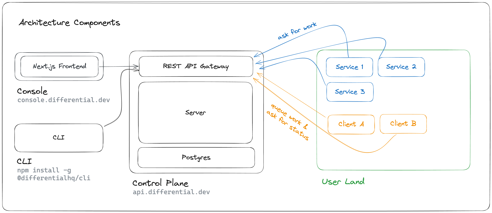

# Architecture

!!!
Differential is currently in technical preview. We've seen promising early results, but our architecture is still evolving. We welcome your thoughts on our design choices. Join the discussion on our [GitHub](https://github.com/differentialhq/differential).
!!!

Differential’s architecture is intentionally straightforward. We adhere to the principle that simplicity leads to easier scalability.

1. A stateful control-plane is backed by postgres and served via a REST API.
2. Services in the user land uses the Differential SDK (`new Differential()`) to register services and ask/poll for incoming function calls.
3. Clients in the user land uses the Differential SDK (`new Differential()`) to queue function calls and poll for completion.
4. All "work" is logically grouped into clusters (`$ differential clusters create`).
5. Console and CLI uses the REST API to manage clusters.
