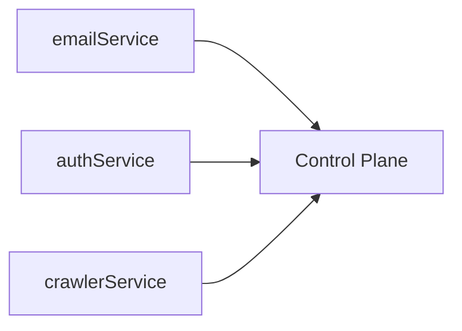
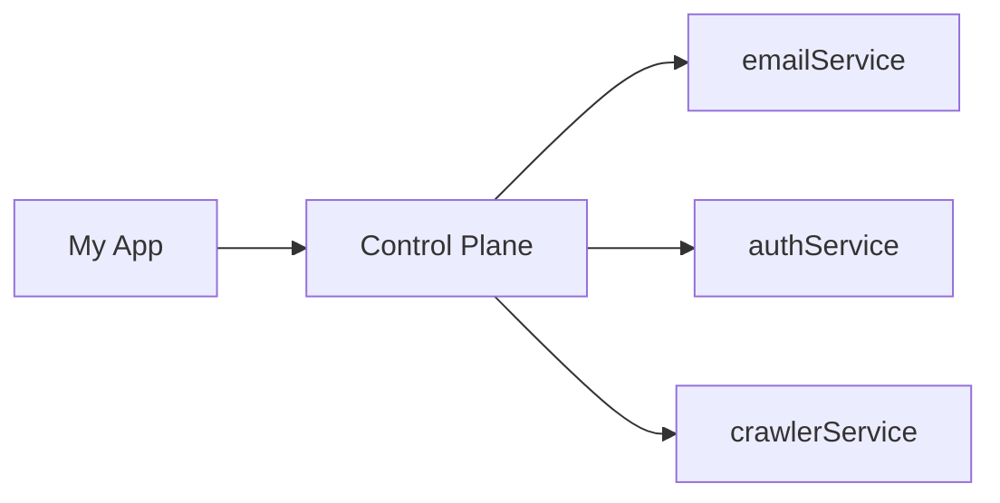
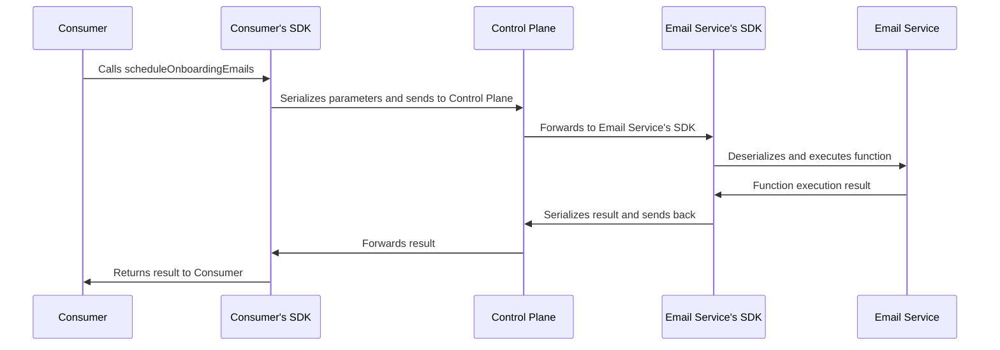

# Thinking in Differential

Differential is a little bit different (pun intended) from the way it looks at separation of services from the way you might be used to.

## The Differential Way

**1. Services are a collection of functions.**

```ts
// src/services/email.ts

export const emailService = d.service({
  name: "email",
  functions: {
    sendWeeklyNewsletterToAll,
    sendPasswordResetEmail,
    scheduleOnboardingEmails,
  },
});
```

**2. There are no restrictions on what these functions can do. They are just functions.**

```ts
// src/modules/email/sendWeeklyNewsletterToAll.ts

export async function sendWeeklyNewsletterToAll() {
  const users = await db.getUsers();
  const emails = users.map((user) => user.email);
  await email.send(emails, "Weekly Newsletter", "...");
  // ...
}
```

**3. Services can be co-located on the same codebase, or spread out across multiple repositories. Differential doesn't make any assumptions on the file structure.**

```ts
src/
 |- services/
 |    |- email.ts
 |    |- auth.ts
 |    └- crawler.ts
 └- index.ts
```

**4. Starting a service is as simple as calling `service.start()`. Stopping is done via a `service.stop()`**.

You can have 1:1 services to processes, or you can have multiple services running in the same process. It's up to you. You can also start and stop services dynamically at runtime.

```ts
// src/index.ts
import { emailService } from "./services/email";

await emailService.start();
```

**5. Once a service is started, it registers itself with the control-plane, and starts asking for "work".**

The open-source control-plane is a central service that keeps track of all the services that are running, and their health. It acts as a service registry, and a service mesh. Your services don't talk to each other directly. Instead, they talk to the control-plane, which routes the function calls to the correct service.



**6. You can call any function in any service from any other service.**

You don't need to know where the service is running, or how to connect to it. You just need to know the name of the service and the name of the function. Function calls get routed to the correct service by the control-plane.



```ts
import { d } from "../d";
import type { emailService } from "./services/email";
import type { authService } from "./services/email";

const email = d.client<typeof emailService>("email");
const auth = d.client<typeof authService>("auth");

async function confirmUserSignup(email: string) {
  await email.scheduleOnboardingEmails(email);
  await auth.onUserSignup(email);
}
```

**7. Your function calls are type-safe**

You can't call a function that doesn't exist, or pass the wrong arguments as long as you set up the client library object with a reference to the service.

```ts
import { d } from "../d";
import type { emailService } from "./services/email";
import type { authService } from "./services/email";

const email = d.client<typeof emailService>("email");
const auth = d.client<typeof authService>("auth");

async function confirmUserSignup(email: string) {
  await email.foo("bar");
  // ⛔️ Error: Property 'foo' does not exist on type 'ServiceClient<RegisteredService<{...}>>'.

  await email.scheduleOnboardingEmails({ foo: "bar" });
  // ⛔️ Error: Argument of type '{ foo: string; }' is not assignable to parameter of type 'string'.
}
```

**8. Calling a function has the same ergonomics as calling a local function.**

You can just call the function and it will return the result, even if it results in an `Error`. SDK and the control-plane routes the function call to the correct service, and does the proper serialization and deserialization of arguments and return values.



## Why?

Differential is an opinionated framework. It makes some tradeoffs to make it easier to build services. They might not be the right tradeoffs for you, but we think they are the right tradeoffs for most people.

**1. Overhead of microservices architecture can have sensible defaults.**

- Microservices architecture can really shine when you want to scale a specific part of your system, prevent cascading failures, move your workloads to on-demand compute etc.
- But the resulting ovehread of managing all the service-to-service communication concerns, tooling, and infrastructure can be overwhelming.
- There exists a set of sensible defaults that can be applied to most services, and common concerns that can be abstracted away.
- Moreover, microservices that can minimize the cold start time, and can be started and stopped dynamically would increase adoption of the architecture.

**2. Writing duplicative service interfaces/contracts can be avoided.**

- A type-safe language that can infer types should be able to infer the contract of a service from the service's implementation.
- Not having a compile step to generate contracts (e.g., protobufs) or a duplicative interface (tRPC) definition allows you to move faster.

**3. Anything a service has ever done can and should be represented by a single function definition.**

- Every RPC framework introduces more complexity to deal with the impedance mismatch between the language and the wire format.
- In REST, it's hard to model operations that `doStuff()`.
- GraphQL has queries and mutations, but you need complex tooling to generate the types.
- Modern RPC frameworks like gRPC and tRPC solve some of the problems, but they make different tradeoffs for stronger contracts and language/runtime interoperability.

**4. Internal services should remain internal.**

- A service should stay internal until it's ready or necessary to be exposed externally. Starting a service on a port should be a conscious decision, not the default.
- Communication via queues and pub/sub is a possible alternative, but it introduces complexities such as keeping track of channels:message types, message serialization, message delivery guarantees, and additional infrastructure configuration that lives outside of the code that does the work.

**5. The disadvantages of a centralized control-plane are outweighed by the advantages.**

- Instead of n services talking to n services, a service bus allows streamlining the communication to a single service and fan-out from there.
- Such an architecture allows for a single place to implement cross-cutting concerns such as authentication, authorization, rate limiting, and observability.
- A service bus that is aware of the application code can provide a better developer experience by offering type-safety and a single place to find all the services and their functions.
