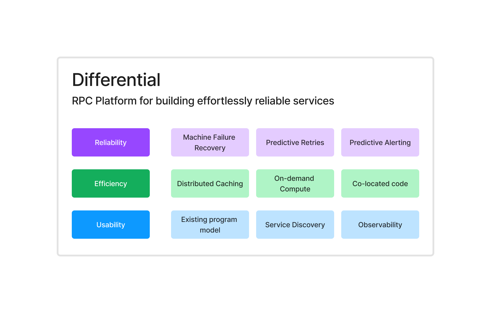

# Differential

> Typescript-first RPC Platform for building effortlessly reliable services

!!!
Differential is in the technical preview stage, and is open-source. We are working hard to make our cloud offering generally available. Sign up for the waitlist [here](https://forms.fillout.com/t/9M1VhL8Wxyus).
!!!

Differential is an open-source "Durable RPC" platform that makes your services more reliable and efficient. By using a centralised control-plane, Differential transparently handles network faults, machine restarts, retries, and more. It comes with end-to-end encryption, observability, service registry, caching, and more without any extra configuration. You just write your functions, and decorate them with the features you need.

## Reliability

- **Machine Failure Recovery**: If a machine goes down while processing your request, Differential can transparently detect it and retry the operation on a healthy worker. See [Compute Recovery](./advanced/compute-recovery.md) for more.
- **Predictive Retries**: With the help of AI Differential detects transient errors (database deadlocks) and retries the operation before the client even notices. See [Predictive Retries](./advanced/predictive-retries.md) for more.
- **Predictive Alerting**: Differential can alert you when a function fails due to an unrecoverable error that requires a code change, and provide you with reproduction steps. See [Predictive Alerting](./advanced/predictive-alerting.md) for more.

## Efficiency

- **Distributed Caching**: Differential can transparently cache the results of your function calls from one worker, so that other workers can use the result without recomputing it. See [Distributed Caching](./advanced/distributed-caching.md) for more.
- **On-demand Compute**: Use our managed compute offering (in alpha) which will run your services as serverless functions with a single command deploy and significantly less cold-start time. See [On-demand Compute](./advanced/on-demand-compute.md) for more.
- **Co-located Code**: You can choose to have all your services co-located, and let Differential run them as independent services at run time. No more splitting code for splitting services. See [Thinking in Differential](./getting-started/thinking.md) for more.

## Usability

- **Use your existing programming paradigm**: Differential doesn't invert your programming paradigm. If you know how to write functions, and call them, you already know how to use Differential. A collection of functions is called a service, and services come with lightweight, fully-typesafe clients that you can use to call them from anywhere. See [Thinking in Differential](./getting-started/thinking.md) for more.
- **Service Discovery**: Differential comes with a built-in service registry, so you can call your services by name, without having to worry about IP addresses, ports, or where it's deployed. Your services phone-home to Differential control-plane. See [Service Discovery](./advanced/service-discovery.md) for more.
- **Observability**: See what's happening in your services in real-time, with end-to-end observability that with zero configuration. See live payloads, events, and errors in the Differential dashboard. See [Observability](./advanced/observability.md) for more.

## Open Source and Self-Hostable

Differential is released under the Apache 2.0 license, and can be self-hosted. This means you can run your own control-plane, and have full control over your data and infrastructure. Optionally, you can use Differential Cloud, which is a fully managed offering that we are working hard to make generally available. Sign up for the waitlist [here](https://forms.fillout.com/t/9M1VhL8Wxyus).

## Quick Start

Follow the [Quick Start](./getting-started/quick-start.md) guide to get up and running with Differential in under 2 minutes.

## See Also:

- [Get up and running with Differential in under 2 minutes](https://docs.differential.dev/getting-started/quick-start/)
- [Thinking in Differential](https://docs.differential.dev/getting-started/thinking/)
